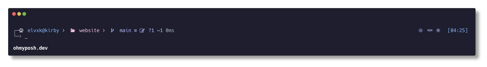

<h3 align="center">
  <samp>&gt; <b>Kirby for <a href="https://ohmyposh.dev/" targert="_blank">Oh My Posh</a></b></samp>
</h3>
<p align="center">
  <samp>「 A special theme with the name <b>KIRBY</b> for <b><a href="https://ohmyposh.dev/" targert="_blank">oh-my-posh</a></b> 」
    <br />Kirby is a theme I created for <a href="https://ohmyposh.dev/" targert="_blank">oh-my-posh</a> users. Kirby was inspired by the <a href="https://github.com/catppuccin" targert="_blank">catppuccin</a> theme color pallet.
    <br />
  </samp>
</p>
<div align="center">


</div>
<br/>
<p align="center">
  <a href="#-preview"><samp>PREVIEW</samp></a>
  <samp> • </samp>
  <a href="#-features"><samp>FEATURES</samp></a>
  <samp> • </samp>
    <a href="#-requirements"><samp>REQUIREMENTS</samp></a>
  <samp> • </samp>
    <a href="#-installation"><samp>INSTALLATION</samp></a>
</p>
<br/>

<br/>

## 📷 Preview

<div align="center">



</div>

## ✨ Features

- 😎 Interesting icon
- 🔭 Supports many programming languages
- 🐱 Information about git
- 🎨 Attractive color

## ⚡ Requirements

- 🐱‍💻 [oh-my-posh](https://ohmyposh.dev)
- 🔠 [nerd font](https://www.nerdfonts.com)
- 💻 Configure your terminal/editor to use the installed font

## 🚀 Installation

- 📦 Requirement Installation

  - To install the font on your terminal see the guide below - [Windows Terminal](https://learn.microsoft.com/en-us/windows/terminal/customize-settings/profile-appearance#font) - [Alacritty](https://www.behova.net/fonts-in-alacritty/) - [Git Bash](https://stackoverflow.com/questions/43378290/git-bash-mingw-64-v2-12-2-how-do-i-change-the-font-size) - [MacOs](https://support.apple.com/en-mz/guide/terminal/trmltxt/mac#:~:text=Use%20Text%20settings%20in%20Terminal,a%20profile%2C%20then%20click%20Text.) - [Linux](https://www.linux.com/topic/desktop/how-change-your-linux-console-fonts/)
    <br/>

  - To install [Oh My Posh](https://ohmyposh.dev) on MacOS/Windows/Linux follow documentation [here](https://ohmyposh.dev/docs/installation/windows).
  - Nerd Fonts are required for the Kirby theme. To display all icons, the use of [Nerd Fonts](https://www.nerdfonts.com) is recommended. More information on fonts can be found [here](https://ohmyposh.dev/docs/installation/fonts).

- 🍻 Activating Kirby Theme

  > For instructions on activating this theme, please refer to the documentation [here](https://ohmyposh.dev/docs/installation/customize).

  - Download the `kirby.omp.json` or clone this repo via terminal

    ```sh
      git clone https://github.com/elvxk/kirby-omp.git
    ```

  - To set a new config/theme you need to change the `--config` option of the `oh-my-posh init <shell>` line in your `profile` or `.<shell>rc` script (see [prompt](https://ohmyposh.dev/docs/installation/prompt)) and point it to the location of a predefined Kirby theme.

    There are two possible values the `--config` flag can handle:

    - a path to a local configuration file

    ```
    oh-my-posh init pwsh --config 'YOUR_DOWNLOAD_FOLDER/kirby.omp.json' | Invoke-Expression
    ```

    - a URL pointing to a remote config

    ```
    oh-my-posh init pwsh --config 'https://raw.githubusercontent.com/elvxk/kirby-omp/main/kirby.omp.json' | Invoke-Expression
    ```

  - Happy Coding 🤘

  <br/>

---

<div align='center'>
<b>ELVXK</b>
<br/>
<br/>
<a href="https://github.com/elvxk" target="_blank"><samp>Github</samp></a>
&nbsp;&middot;&nbsp;
<a href="https://github.com/elvxk" target="_blank"><samp>Instagram</samp> </a>
&nbsp;&middot;&nbsp;
<a href="https://www.linkedin.com/in/elvxk/" target="_blank"><samp>Linkedin</samp></a>
&nbsp;&middot;&nbsp;
<a href="https://dribbble.com/elvxk" target="_blank"><samp>Dribbble</samp></a>
<br/>
<a href="https://sandri.my.id" target="_blank"><samp>www.sandri.my.id</samp></a>
</div>
